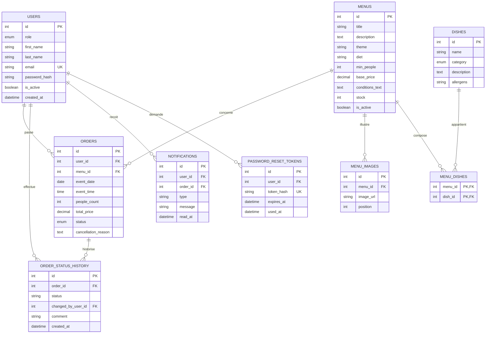
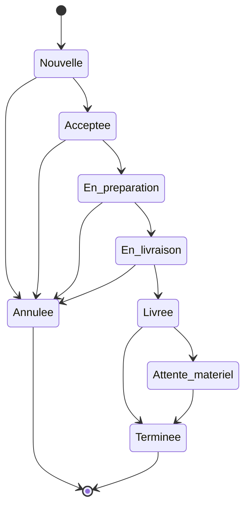
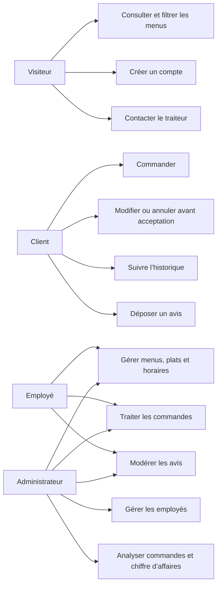
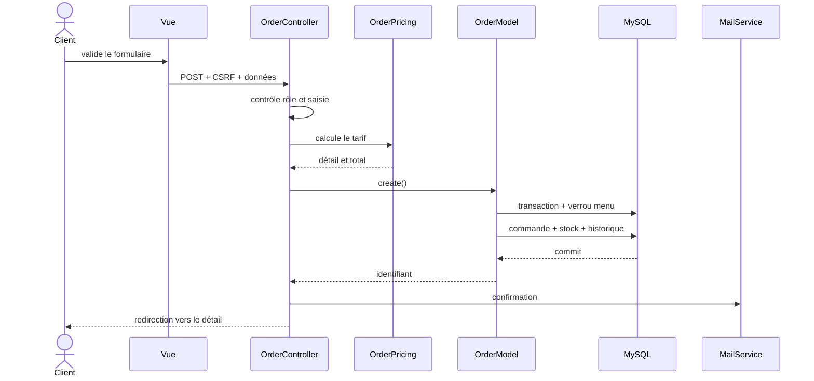
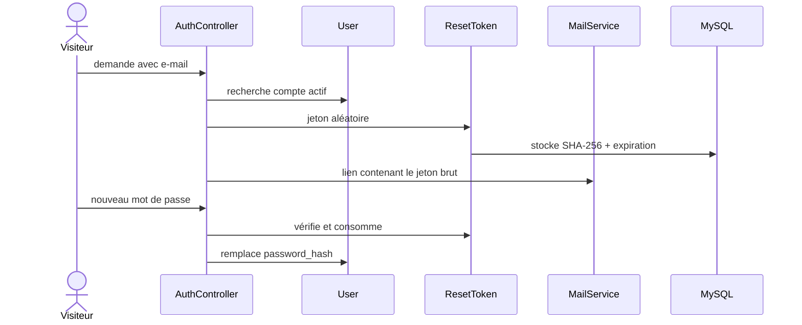

# Documentation technique - Vite & Gourmand

## 1. Vue d’ensemble

Vite & Gourmand est une application PHP rendue côté serveur. Un contrôleur
frontal reçoit toutes les requêtes, choisit un contrôleur métier, puis charge
une vue dans le gabarit commun.

```text
Navigateur
  -> public/index.php
  -> Controller
  -> Model / Service
  -> MySQL ou MongoDB
  -> View
  -> app/Views/layouts/main.php
  -> Réponse HTML
```

Le code cible PHP 8.2 et utilise `declare(strict_types=1)`.

## 2. Architecture MVC

### Contrôleur frontal

`public/index.php` :

- démarre une session sécurisée ;
- charge Composer, `.env`, la base et le service CSRF ;
- pose les en-têtes de sécurité ;
- associe `?page=...` à une action ;
- transforme les `HttpException` en pages 4xx ;
- journalise les erreurs inattendues et renvoie une page 500 ;
- prépare les horaires et badges de navigation ;
- charge le gabarit principal.

### Contrôleurs

| Classe | Responsabilité |
| --- | --- |
| `HomeController` | accueil et avis validés |
| `MenuController` | catalogue, détail et gestion des menus |
| `DishController` | gestion des plats |
| `AuthController` | inscription, connexion, profil et mot de passe |
| `OrderController` | commandes client et employé |
| `ReviewController` | dépôt et modération des avis |
| `AdminController` | comptes employés et statistiques |
| `HoursController` | horaires |
| `ContactController` | demandes de contact |
| `PageController` | mentions, CGV et confidentialité |

Les contrôleurs héritent de `App\Core\Controller`, qui centralise le rendu, les
redirections, les erreurs et les contrôles d’accès.

### Modèles

Les modèles SQL héritent de `App\Models\Model` et reçoivent une instance PDO.
`Review` et `OrderAnalytics` utilisent le pilote officiel MongoDB.

Les vues n’exécutent pas de requête et n’appliquent pas de règle métier.

### Services

| Service | Rôle |
| --- | --- |
| `OrderPricing` | calcul déterministe du prix |
| `MailService` | contenu et envoi des e-mails |
| `csrf.php` | création du champ et validation du jeton |
| `Environment` | chargement structuré du fichier `.env` |
| `Url` | URL absolues des pages et ressources |

## 3. Routage et accès

Le routeur est une table explicite :

```php
'employee-orders' => [OrderController::class, 'manage'],
'employee-menus' => [MenuController::class, 'manage'],
'admin-dashboard' => [AdminController::class, 'dashboard'],
```

Contrôles :

- `requireUser()` : compte connecté, encore actif et resynchronisé avec la base ;
- `requireRole(['employee', 'admin'])` : back-office opérationnel ;
- `requireRole(['admin'])` : statistiques et employés.

Une autorisation est toujours vérifiée côté serveur. Le masquage d’un lien de
navigation n’est jamais considéré comme une protection.

## 4. Modèle conceptuel relationnel



Tables complémentaires :

- `business_hours` : plages d’ouverture par jour ;
- `contact_messages` : demandes envoyées depuis le site ;
- `reviews` SQL : table historique non utilisée par la fonctionnalité active.

Le schéma complet est dans `database/schema.sql`. La migration additive pour une
ancienne installation est dans `database/migrations/20260718_complete_ecf.sql`.

## 5. Données NoSQL

### Collection `reviews`

```json
{
  "id": "review_...",
  "order_id": 42,
  "user_id": 7,
  "user_name": "Prénom Nom",
  "menu_id": 3,
  "menu_title": "Menu Classique",
  "rating": 5,
  "comment": "Commentaire du client",
  "status": "pending",
  "created_at": "2026-07-18 12:00:00"
}
```

Statuts : `pending`, `validated`, `refused`.

L’index unique `unique_review_per_order` empêche deux avis pour une même
commande. Les index sont décrits dans `database/mongodb-indexes.js`.

### Collection `order_analytics`

Cette projection contient l’identifiant de commande, le menu, le montant, le
statut et la date. Le tableau de bord l’actualise par `upsert`, puis agrège :

- le nombre de commandes non annulées par menu ;
- le chiffre d’affaires par menu ;
- les résultats limités par menu et période.

Si MongoDB est indisponible, le contrôleur calcule les mêmes données depuis SQL
et affiche explicitement la source de secours.

## 6. Règles métier

### Prix

Pour un menu de minimum `M`, de prix de base `P`, commandé pour `N` personnes :

```text
prix_menu = P × (N / M)
remise = 10 % du prix_menu si N >= M + 5
livraison = 0 € à Bordeaux, sinon 5 €
total = prix_menu - remise + livraison
```

Le calcul JavaScript donne un retour immédiat, mais le serveur recalcule toujours
le total avec `OrderPricing`.

### Stock

La création d’une commande :

1. démarre une transaction ;
2. verrouille le menu avec `SELECT ... FOR UPDATE` ;
3. contrôle activité et stock ;
4. insère la commande ;
5. décrémente le stock ;
6. crée le premier historique ;
7. valide la transaction.

Une annulation restaure le stock une seule fois.

### Cycle de commande



Le client modifie ou annule uniquement au statut `nouvelle`. L’employé doit
indiquer un moyen de contact et un motif pour annuler.

### Menus

- titre de 2 à 150 caractères ;
- description et conditions obligatoires ;
- minimum et stock entiers positifs ;
- prix positif ;
- une entrée, un plat et un dessert au minimum ;
- six images maximum ;
- archivage logique avec `is_active = 0` et `stock = 0`.

## 7. Cas d’utilisation



## 8. Séquence de commande



## 9. Séquence de réinitialisation



## 10. Sécurité

| Menace | Mesure |
| --- | --- |
| Injection SQL | requêtes préparées PDO |
| XSS réfléchi ou stocké | `htmlspecialchars` dans les vues |
| CSRF | jeton de session et POST sur les actions |
| Vol de mot de passe | `password_hash` / `password_verify` |
| Énumération de comptes | réponse neutre au mot de passe oublié |
| Brute force | cinq échecs puis blocage de quinze minutes |
| Fixation de session | `session_regenerate_id(true)` à la connexion |
| Accès horizontal | recherche commande avec `user_id` du compte |
| Accès vertical | `requireRole` côté contrôleur |
| Secret Git | fichiers réels ignorés et exemples neutralisés |
| Fuite d’erreur | détails masqués en production, journalisation serveur |
| Clickjacking / MIME | en-têtes `X-Frame-Options` et `nosniff` |
| Chargement de contenu tiers | politique CSP, ressources front-end locales |
| Repli vers HTTP | HSTS lorsque l’application est servie en HTTPS |

Les jetons de mot de passe sont générés par `random_bytes`, stockés uniquement
sous forme de hachage SHA-256 et invalidés après utilisation.

## 11. Résilience

- l’accueil reste disponible si MongoDB ne répond pas ;
- l’espace client conserve le suivi des commandes sans les avis ;
- l’administration utilise SQL si les statistiques MongoDB échouent ;
- un échec de `mail()` est journalisé sans annuler la transaction métier ;
- les horaires ont des valeurs par défaut si leur lecture échoue ;
- Bootstrap et Chart.js sont locaux, sans dépendance CDN.

## 12. Front-end

Bootstrap fournit la grille, les formulaires, alertes et composants accessibles.
`public/css/style.css` définit l’identité et le responsive.

JavaScript reste progressif :

- `menu-filters.js` filtre les cartes à partir d’attributs `data-*` ;
- `app.js` masque les confirmations, confirme les actions risquées, gère les
  horaires, l’annulation employé et l’aperçu du prix.

Le serveur n’accorde jamais sa confiance au calcul ou au filtrage du navigateur.

## 13. Tests

```bash
composer test
composer test:integration
composer validate --no-check-publish
```

- `mvc_architecture.php` contrôle classes, routes et vues ;
- `domain_rules.php` contrôle prix, transitions et URL ;
- `database_integration.php` contrôle les transactions sur données temporaires.

La recette HTTP vérifie les pages publiques, les routes par rôle, la page 404 et
l’absence d’avertissement PHP. Les captures Playwright couvrent accueil, menus
et détail en `1440 × 1000` et `390 × 844`.

## 14. Configuration et déploiement

Voir [`deploiement.md`](deploiement.md). Les secrets attendus sont :

- `config/database.php` ;
- `config/mongodb.php` ;
- éventuellement `.env` ou les variables serveur équivalentes.

Ils ne doivent jamais être commités.

## 15. Limites connues

- `mail()` dépend de la configuration de l’hébergeur et doit être testé en production ;
- les mentions légales doivent recevoir l’identité définitive de l’éditeur ;
- la conformité RGAA complète nécessite un audit spécialisé ;
- MongoDB Atlas doit autoriser l’IP du serveur de production.
