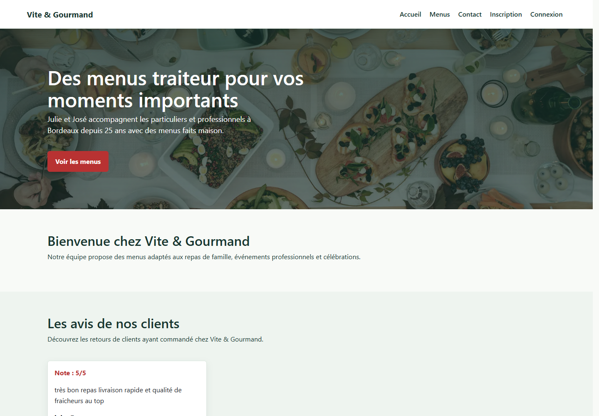
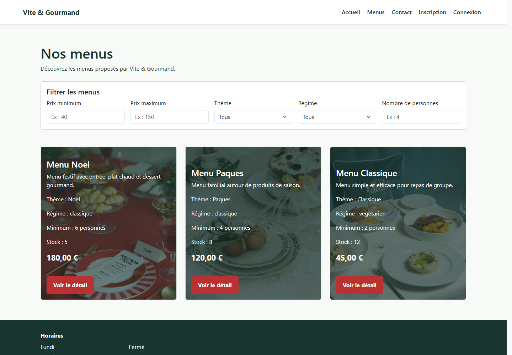
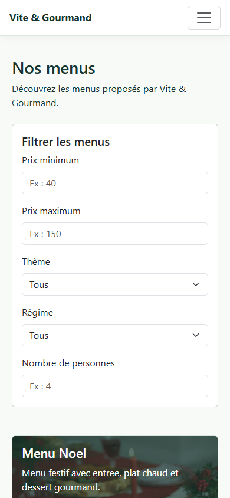
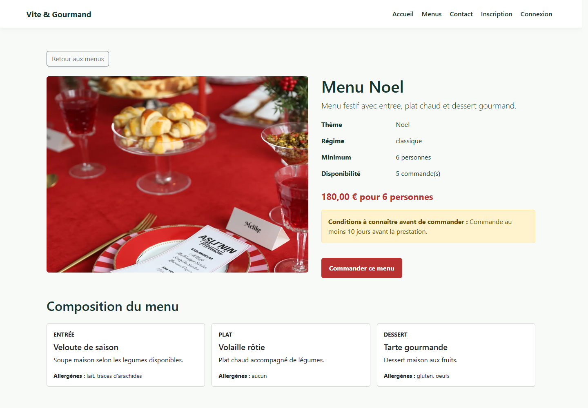
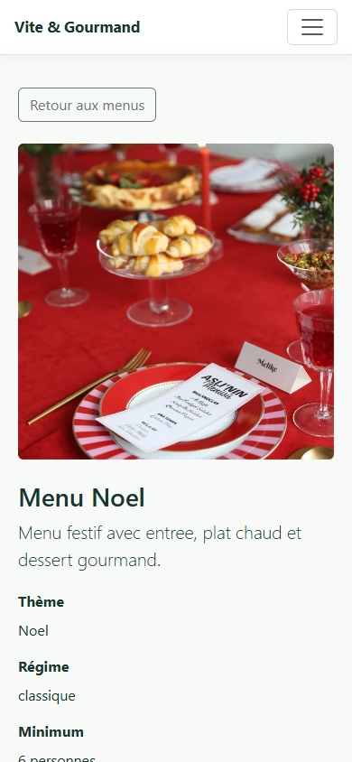

# Maquettes et wireframes

## Wireframes

Les six wireframes basse fidélité sont regroupés dans
[`wireframes.html`](wireframes.html) :

- accueil ordinateur et mobile ;
- liste des menus ordinateur et mobile ;
- détail d’un menu ordinateur et mobile.

## Maquettes issues de l’application

Les maquettes haute fidélité sont des captures de la version fonctionnelle,
rendues avec Playwright aux dimensions réelles.

| Écran | Ordinateur 1440 × 1000 | Mobile 390 × 844 |
| --- | --- | --- |
| Accueil | [`accueil-desktop.png`](maquettes/accueil-desktop.png) | [`accueil-mobile.png`](maquettes/accueil-mobile.png) |
| Menus | [`menus-desktop.png`](maquettes/menus-desktop.png) | [`menus-mobile.png`](maquettes/menus-mobile.png) |
| Détail menu | [`menu-detail-desktop.png`](maquettes/menu-detail-desktop.png) | [`menu-detail-mobile.png`](maquettes/menu-detail-mobile.png) |

### Accueil

### Liste des menus

### Détail d’un menu

## Choix responsive

- navigation repliée sous `576 px` ;
- titre et marges réduits sur mobile ;
- filtres et cartes empilés sur une colonne ;
- galerie carrée sur mobile et au ratio 4/3 sur ordinateur ;
- tableaux du back-office contenus dans une zone de défilement horizontal.
